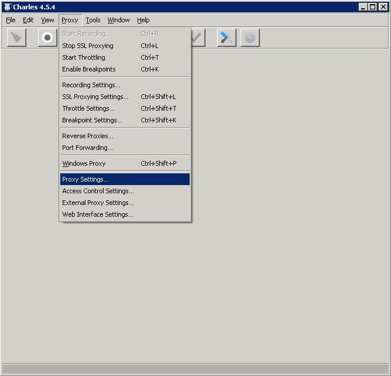
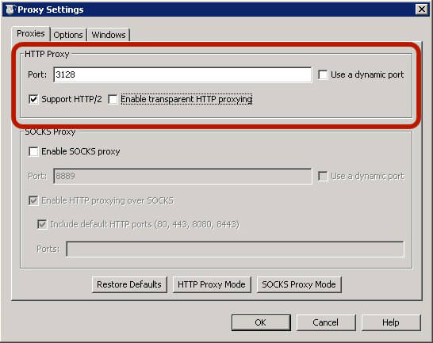
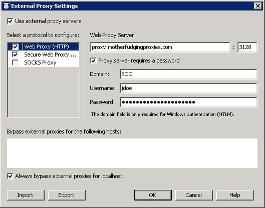
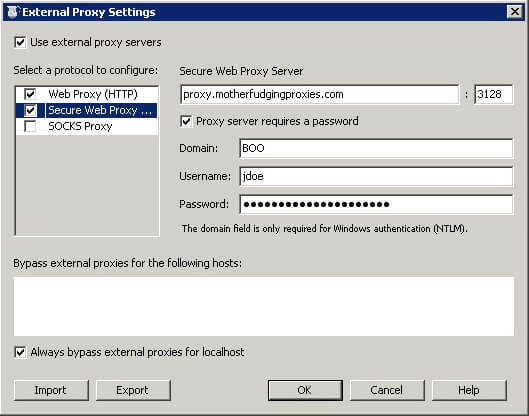

### [Charles Proxy](https://www.charlesproxy.com)

!> Charles proxy debugging is not supposed to be used for network tunnelling, but it works as a by-product. As a result, leaving it on 24/7 means most of your device's resources get eaten up by the session recorder. This shows you how to turn it off

1. Open the app

 

1. Stop the recording and clear the session

 

1. Open the preferences `CTRL + ,` and under `Launch` uncheck the `Open new session` and press `OK`

 

1. From the menubar, open up the `Proxy Settings...`

 

1. Set the port that the device will use to connect (this example I'm using the same port as the proxy `3128`)

 

1. Under the `Windows` tab that all the options are checked

 

1. From the menubar, open up the `External Proxy Settings...`

 

1. Check the `Use external proxy servers` option and fill in the HTTP and HTTPS settings

 
 

1. Press `OK`
