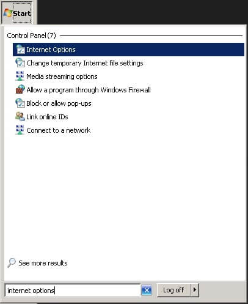
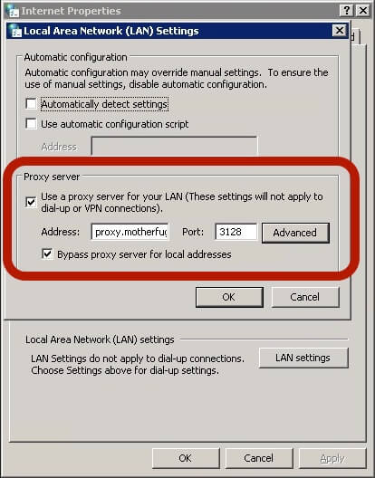

# Windows

Windows was fairly consistent in their proxy settings up until they released their new interfaced version and new transitional Settings App.

Usually when you configure one of the places for proxies in Windows it does filter to the other, but it is always good practice to make sure!

## Standard way

### Control Panel

1. Open the `Start` menu and search for `Internet Options` and open it

 

1. Go to the `Connections` tab

 

1. Towards the bottom, press the `LAN settings` button

 

1. With the pop up dialogue window, check the `Use a proxy server for your LAN`

 

1. In the address enter the proxy server address and port number

1. Check the `Bypass proxy server for local addresses`

  ?> This setting means anything that is within the scope of `.local` or in the domain will not use the proxy

1. Press the `Advanced` button to open the advanced Proxy Settings menu

 

1. If you need to specify separate proxy addresses for each of the protocols you can do that here, or if you need to bypass other IP addresses or domains you can do it at the bottom too

### Settings App

## Helpers

Helper apps are really good at tunnelling all the network traffic into the localhost and then sending it through to the external proxy server.

When using these apps the above Windows settings for proxy should be configured to the localhost or `127.0.0.1` and whatever port you use from the app (`3128` in these examples).

### [Charles Proxy](https://www.charlesproxy.com)

!> Charles proxy debugging is not supposed to be used for network tunnelling, but it works as a by-product. As a result, leaving it on 24/7 means most of your device's resources get eaten up by the session recorder. This shows you how to turn it off

1. Open the app

1. Stop the recording and clear the session

1. Open the preferences `CMD + ,` and under `Launch` uncheck the `Open new session` and press `OK`

1. From the menubar, turn on `macOS Proxy`

1. From the menubar, open up the `Proxy Settings...`

1. Set the port that the device will use to connect (this example I'm using the same port as the proxy `3128`)

1. Under the `macOS` tab that all the options are checked

1. From the menubar, open up the `External Proxy Settings...`

1. Check the `Use external proxy servers` option and fill in the HTTP and HTTPS settings

1. Press `OK`

## Other pages

[View macOS proxy settings](/proxy/macos ':class=mb-button')
[View Linux proxy settings](/proxy/linux ':class=mb-button')
[View Applications proxy settings](/proxy/apps ':class=mb-button')
[Go home](/ ':class=mb-button')
